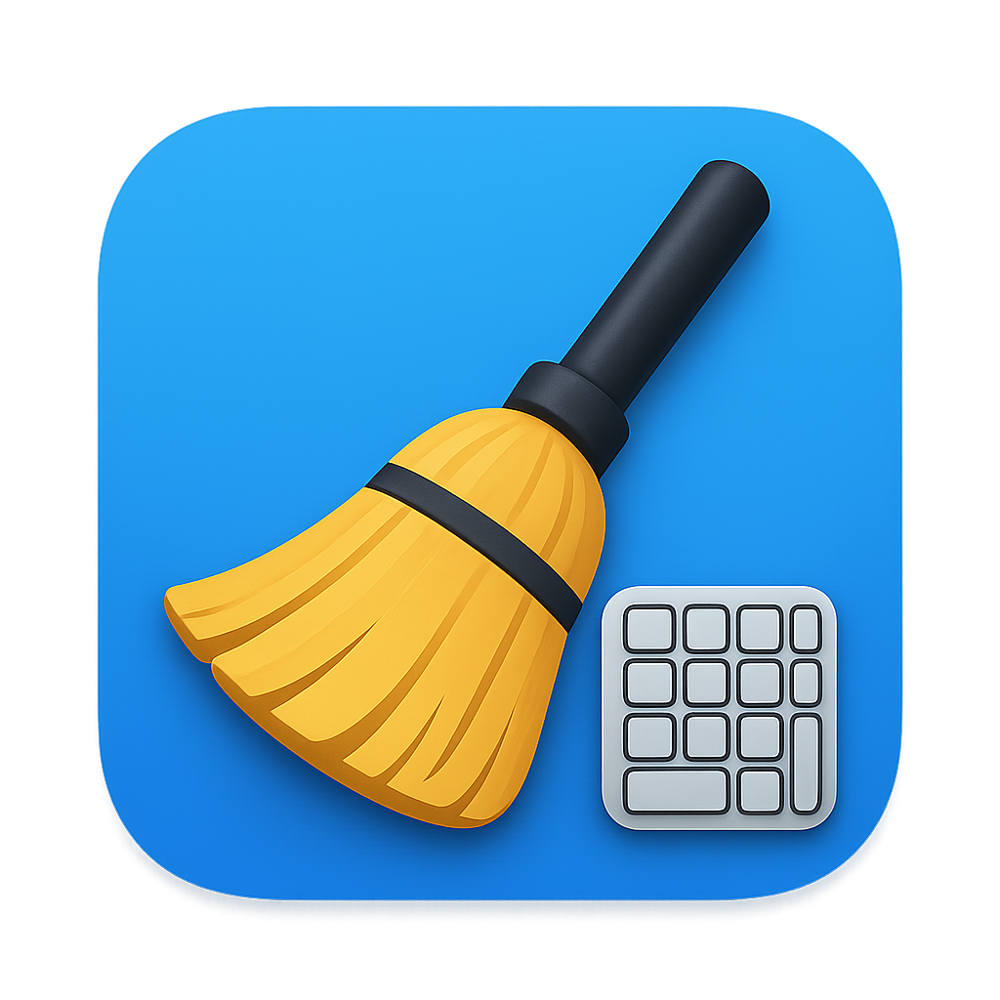

# CleanKeyboard 🧹

A simple macOS application to temporarily block your keyboard for safe cleaning.

<p align="center">
  
</p>

## Features

- 🔒 **Complete keyboard blocking** with one click
- 🧹 **Safe cleaning** without accidental keystrokes
- 🔓 **Easy unlock** when cleaning is done
- 📱 **Simple interface** with clear status indicators
- 🔔 **Notifications** to confirm lock/unlock status
- 🛡️ **Privacy-focused** - no data collection, works entirely offline

## Download

### Latest Release
Download the latest version from the [Releases](https://github.com/Sauron-sol/CleanKeyboardMac/releases) page.

### Quick Install
1. Download `CleanKeyboard.dmg` from the latest release
2. Open the DMG file
3. Drag `CleanKeyboard.app` to your Applications folder
4. Launch the application

## Usage

1. **Launch CleanKeyboard** from your Applications folder
2. **Click "🔓 Start Cleaning"** to lock the keyboard
3. **Grant accessibility permissions** when prompted (first time only)
4. **Clean your keyboard safely** - all keystrokes are blocked
5. **Click "🔒 Stop Cleaning"** to unlock the keyboard

### Setting up Accessibility Permissions

CleanKeyboard requires accessibility permissions to function:

1. Go to **System Preferences** → **Security & Privacy** → **Privacy**
2. Select **Accessibility** from the left sidebar
3. Click the lock icon 🔒 to make changes
4. Click the **"+"** button and add CleanKeyboard
5. Ensure CleanKeyboard is checked ✅

## System Requirements

- **macOS 10.15** (Catalina) or later
- **Intel** or **Apple Silicon** Mac

## Building from Source

### Prerequisites
- Xcode command line tools: `xcode-select --install`

### Build Steps
```bash
# Clone the repository
git clone https://github.com/Sauron-sol/CleanKeyboardMac.git
cd CleanKeyboardMac

# Build the application and create DMG
./build.sh

# Install locally (optional)
./install.sh
```

The build script will:
- Compile the application using `clang`
- Create the app bundle with icon
- Generate a distributable DMG file

## Project Structure

```
CleanKeyboardMac/
├── main.m              # Application entry point
├── AppDelegate.h/m     # Main application logic and UI
├── KeyboardBlocker.h/m # Keyboard event interception
├── Info.plist          # App configuration and permissions
├── icon.png            # Source icon (1024x1024)
├── CleanKeyboard.icns  # Generated macOS icon bundle
├── build.sh            # Build and packaging script
├── install.sh          # Local installation script
└── README.md           # This file
```

## How It Works

CleanKeyboard uses macOS's `CGEventTap` API to intercept keyboard events at the system level. When activated:

1. **Event Tap Creation**: Creates a system-level event tap for keyboard events
2. **Event Filtering**: Intercepts all keyboard down/up events
3. **Event Blocking**: Returns `NULL` for keyboard events (blocks them)
4. **Mouse Pass-through**: Allows mouse events to continue normally

The application is designed to be:
- **Lightweight** (~50KB executable)
- **Secure** (requires explicit accessibility permissions)
- **Reliable** (uses standard macOS APIs)

## Security & Privacy

- ✅ **No data collection** - CleanKeyboard doesn't collect, store, or transmit any data
- ✅ **No network access** - Works entirely offline
- ✅ **Open source** - Full source code available for audit
- ✅ **Minimal permissions** - Only requests accessibility access for keyboard blocking
- ✅ **Local operation** - All processing happens on your device

## Contributing

Contributions are welcome! Please feel free to:
- 🐛 Report bugs via [Issues](https://github.com/Sauron-sol/CleanKeyboardMac/issues)
- 💡 Suggest features via [Issues](https://github.com/Sauron-sol/CleanKeyboardMac/issues)  
- 🔧 Submit pull requests
- ⭐ Star the repository if you find it useful

## License

This project is licensed under the MIT License - see the [LICENSE](LICENSE) file for details.

## Acknowledgments

- Icon design: Custom keyboard cleaning icon
- Built with: Objective-C and macOS native frameworks
- Inspired by the need for safe keyboard cleaning during the digital age

---

**⚠️ Note**: This application is designed solely for keyboard cleaning purposes. Always ensure you can access your mouse to unlock the keyboard when cleaning is complete.